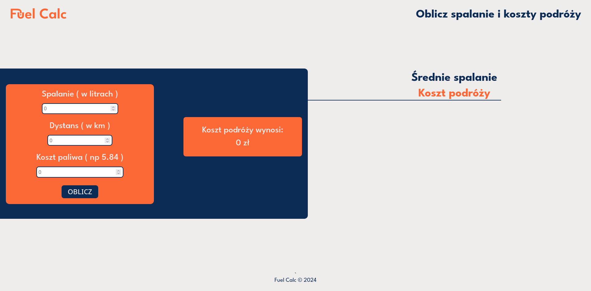

# FuelCalc 👋

<div style="display: flex;">
  
  
</div>

## About 👀


Fuel Calc. <br/>

Mobile version: yes!

PageSpeed Insights:

- [Mobile](https://pagespeed.web.dev/analysis/https-fuelcalcs-netlify-app/1d2f4542x5?hl=en&form_factor=mobile): <br/>
   <br/>
- [Dekstop](https://pagespeed.web.dev/analysis/https-fuelcalcs-netlify-app/1d2f4542x5?hl=en&form_factor=desktop): <br/>
  

## How can I try it? 🤔

Try now on: https://fuelcalcs.netlify.app/ <br/>

## Instalation steps 📋

1. Copy this repository

```
gh repo clone BartoszBuko/FuelCalc
cd ./FuelCalc
```

or

```
git clone https://github.com/BartoszBuko/FuelCalc.git
cd ./FuelCalc
```

2. Open files in browser.

And that's all!

## About UX/UI 🖌️

I made design all by myself




Figma: [click here](https://www.figma.com/file/loNidJIspbYr7Ovkaar3Ue/portfolio?type=design&node-id=0%3A1&t=dCv3DtJCBgh5dOl3-1) <br>

## Technological facilities 🛠️

- HTML5
- CSS3
- JavaScript (ES6+)
